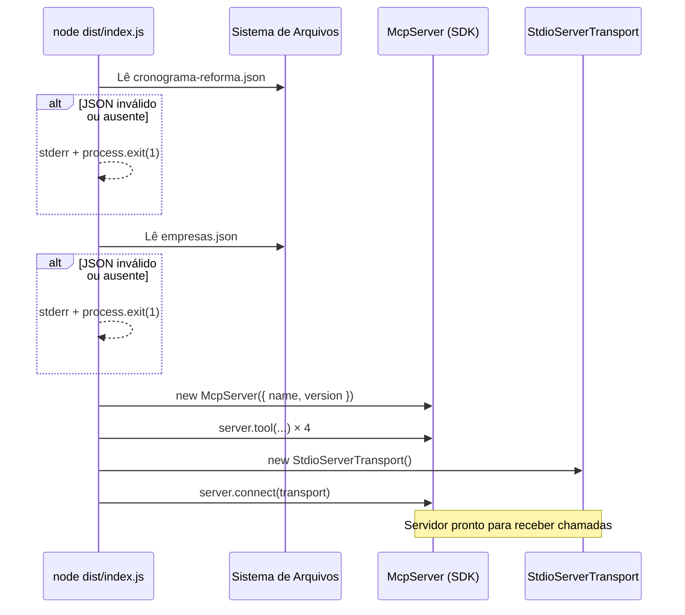

# Design Document — mcp-frete-tributario

## Overview

O **mcp-frete-tributario** é um servidor MCP local escrito em TypeScript que expõe quatro ferramentas para cálculo e consulta de tributação de frete no contexto da Reforma Tributária brasileira (LC 214/2025). O servidor utiliza transporte stdio, é inicializado via `node dist/index.js` e integra-se a clientes MCP como Claude Desktop e Cursor.

O design segue uma arquitetura em camadas: a camada de protocolo (`@modelcontextprotocol/sdk`) gerencia comunicação MCP, a camada de ferramentas (`src/tools/`) implementa a lógica de negócio de cada tool, e a camada de serviços (`src/services/`) encapsula integrações externas (BrasilAPI). Dados estáticos residem em arquivos JSON pré-carregados na inicialização.

**Decisões de design relevantes:**
- Dados do cronograma e empresas são lidos uma única vez na startup e mantidos em memória, garantindo latência < 50 ms nas consultas.
- O arredondamento monetário usa a estratégia *half-up* implementada via multiplicação por 100, `Math.round`, e divisão por 100.
- As duas consultas BrasilAPI na `simular_impacto_rota` são disparadas com `Promise.all` para evitar latência acumulada.
- Toda exceção em handlers de tool é capturada localmente; o processo do servidor nunca encerra por erro de tool individual.

---

## Architecture

O servidor segue uma arquitetura em três camadas com separação clara de responsabilidades:

```
┌──────────────────────────────────────────────────────────────┐
│                     MCP Client (Claude / Cursor)             │
└──────────────────────┬───────────────────────────────────────┘
                       │ stdio (stdin/stdout)
┌──────────────────────▼───────────────────────────────────────┐
│  src/index.ts  — Bootstrap Layer                             │
│  • Carrega dados JSON na startup (cronograma + empresas)     │
│  • Instancia McpServer + StdioServerTransport               │
│  • Registra as 4 tools com schemas zod                       │
│  • Encerra com exit(1) se dados essenciais falharem          │
└──────────────────────┬───────────────────────────────────────┘
                       │
┌──────────────────────▼───────────────────────────────────────┐
│  src/tools/  — Business Logic Layer                          │
│  ├── calcularCargaTributaria.ts                              │
│  ├── consultarCronograma.ts                                  │
│  ├── simularImpactoRota.ts                                   │
│  └── listarEmpresas.ts                                       │
└──────────┬───────────────────────────────────────────────────┘
           │
┌──────────▼────────────────────────────────────────────────────┐
│  src/services/  — Integration Layer                           │
│  └── brasilApiService.ts  (fetch CNPJ → { uf, razao_social }) │
│                                                               │
│  src/data/  — Static Data Layer                               │
│  ├── cronograma-reforma.json  (8 entradas 2026–2033)         │
│  └── empresas.json            (≥5 empresas com UFs distintas) │
└───────────────────────────────────────────────────────────────┘
```

### Fluxo de inicialização



---

## Components and Interfaces

### `src/index.ts` — Bootstrap

Responsável por:
1. Carregar e validar os arquivos JSON de dados.
2. Instanciar o `McpServer` do `@modelcontextprotocol/sdk`.
3. Registrar as quatro tools via `server.tool(name, description, zodSchema, handler)`.
4. Conectar o servidor ao `StdioServerTransport`.

```typescript
import { McpServer } from "@modelcontextprotocol/sdk/server/mcp.js";
import { StdioServerTransport } from "@modelcontextprotocol/sdk/server/stdio.js";

const server = new McpServer({ name: "mcp-frete-tributario", version: "1.0.0" });
// ... registrar tools ...
const transport = new StdioServerTransport();
await server.connect(transport);
```

### `src/tools/calcularCargaTributaria.ts`

**Input schema (zod):**

```typescript
z.object({
  valorFrete: z.number().positive(),
  ufOrigem:   z.string().length(2).toUpperCase(),
  ufDestino:  z.string().length(2).toUpperCase(),
  ano:        z.number().int().min(2026).max(2033),
  ncm:        z.string().optional(),
})
```

**Handler logic:**
1. Valida `ufOrigem` / `ufDestino` contra lista de 27 UFs.
2. Busca entrada do cronograma pelo `ano`.
3. Se `ncm` fornecido, procura alíquota diferenciada; se não encontrar, usa padrão.
4. Calcula valores aplicando arredondamento half-up (ver seção Data Models).
5. Retorna `Carga_Tributaria` completa ou `{ isError: true, content: [{ type: "text", text: msg }] }`.

### `src/tools/consultarCronograma.ts`

**Input schema (zod):**

```typescript
z.object({ ano: z.number().int().min(2026).max(2033) })
```

**Handler logic:**
1. Localiza a entrada do cronograma pelo `ano` (acesso O(1) via Map pré-construído).
2. Calcula `totalNovoRegime = ibs + cbs` e `totalAntigoRegime = icms + iss + pis + cofins`, arredondados a 2 casas.
3. Retorna os percentuais + totais calculados.

### `src/tools/simularImpactoRota.ts`

**Input schema (zod):**

```typescript
z.object({
  cnpjOrigem:  z.string(),
  cnpjDestino: z.string(),
  valorFrete:  z.number().positive(),
})
```

**Handler logic:**
1. Valida `valorFrete > 0`.
2. Normaliza os CNPJs (remove máscara, valida 14 dígitos numéricos).
3. Consulta BrasilAPI em paralelo: `Promise.all([fetchCnpj(cnpjOrigem), fetchCnpj(cnpjDestino)])` com timeout de 5000 ms.
4. Extrai `uf` e `razao_social` de cada resposta.
5. Determina `anoCorrente = new Date().getFullYear()`; valida que está em [2026, 2033].
6. Delega ao handler de `calcularCargaTributaria` para computar a `Carga_Tributaria`.
7. Retorna resultado completo.

### `src/tools/listarEmpresas.ts`

**Input schema (zod):**

```typescript
z.object({})
```

**Handler logic:**
1. Lê o array de empresas (já em memória desde a startup).
2. Retorna `{ empresas: Empresa[], totalEmpresas: number }`.

### `src/services/brasilApiService.ts`

Interface de integração com a BrasilAPI:

```typescript
interface BrasilApiCnpjResponse {
  uf: string;
  razao_social: string;
  // demais campos ignorados
}

async function fetchCnpj(
  cnpj: string,
  timeoutMs = 5000
): Promise<BrasilApiCnpjResponse>
// Lança BrasilApiError com { cnpj, motivo } se HTTP >= 400 ou timeout
```

O timeout é implementado com `Promise.race` entre o `fetch` e um `setTimeout` rejeitor, ou com `AbortController` + `signal` no `fetch`.

**Decisão de design:** O serviço lança exceções tipadas (`BrasilApiError`) que o handler da tool captura e converte em `isError: true` com a mensagem formatada conforme o requisito.

---

## Data Models

### `CronogramaEntry` — `src/data/cronograma-reforma.json`

```typescript
interface CronogramaEntry {
  ano:    number; // 2026–2033
  icms:   number; // pontos percentuais, 0–100, até 2 casas decimais
  iss:    number;
  pis:    number;
  cofins: number;
  ibs:    number;
  cbs:    number;
}
// Array com exatamente 8 entradas, uma por ano
type Cronograma = CronogramaEntry[];
```

O arquivo será carregado na startup e indexado em um `Map<number, CronogramaEntry>` para acesso O(1) por ano.

**Valores de referência (baseados na LC 214/2025):**

| Ano  | ICMS  | ISS  | PIS  | COFINS | IBS   | CBS   |
|------|-------|------|------|--------|-------|-------|
| 2026 | 12.00 | 2.00 | 0.65 | 3.00   | 0.10  | 0.10  |
| 2027 | 12.00 | 2.00 | 0.65 | 3.00   | 0.10  | 0.10  |
| 2028 | 9.60  | 1.60 | 0.52 | 2.40   | 3.20  | 2.40  |
| 2029 | 7.20  | 1.20 | 0.39 | 1.80   | 6.40  | 4.80  |
| 2030 | 4.80  | 0.80 | 0.26 | 1.20   | 9.60  | 7.20  |
| 2031 | 2.40  | 0.40 | 0.13 | 0.60   | 12.80 | 9.60  |
| 2032 | 0.00  | 0.00 | 0.00 | 0.00   | 16.00 | 12.00 |
| 2033 | 0.00  | 0.00 | 0.00 | 0.00   | 16.00 | 12.00 |

> Estes valores são de referência para fins educacionais. Os percentuais reais serão definidos por regulamentação específica.

### `Empresa` — `src/data/empresas.json`

```typescript
interface Empresa {
  razaoSocial:        string;  // não vazia
  cnpj:               string;  // exatamente 14 dígitos numéricos
  uf:                 string;  // sigla de UF válida
  valorUltimoFrete:   number;  // >= 0
}
type EmpresasDB = Empresa[];   // >= 5 entradas, UFs distintas
```

### `CargaTributaria` — Modelo de Saída

```typescript
interface CargaTributaria {
  aliquotaNominal:    number; // ibs% + cbs% para o ano
  valorIBS:           number; // valorFrete × ibs% / 100, half-up 2 casas
  valorCBS:           number; // valorFrete × cbs% / 100, half-up 2 casas
  totalNovoRegime:    number; // valorIBS + valorCBS, half-up 2 casas
  valorICMS:          number; // valorFrete × icms% / 100, half-up 2 casas
  valorPIS:           number; // valorFrete × pis% / 100, half-up 2 casas
  valorCOFINS:        number; // valorFrete × cofins% / 100, half-up 2 casas
  totalAntigoRegime:  number; // valorICMS + valorPIS + valorCOFINS, half-up 2 casas
}
```

### Função de arredondamento half-up

```typescript
function halfUp(value: number): number {
  return Math.round(value * 100) / 100;
}
```

`Math.round` em JavaScript usa half-up para valores positivos (arredonda .5 para cima), satisfazendo o requisito 1.7.

### Constante `UF_VALIDAS`

```typescript
const UF_VALIDAS = new Set([
  "AC","AL","AP","AM","BA","CE","DF","ES","GO","MA",
  "MT","MS","MG","PA","PB","PR","PE","PI","RJ","RN",
  "RS","RO","RR","SC","SP","SE","TO"
]);
```

---

## Correctness Properties

*A property is a characteristic or behavior that should hold true across all valid executions of a system — essentially, a formal statement about what the system should do. Properties serve as the bridge between human-readable specifications and machine-verifiable correctness guarantees.*

**Nota sobre aplicabilidade de PBT:** Este servidor contém lógica pura de cálculo aritmético, validação de entradas, e transformações de dados — todas altamente adequadas a testes baseados em propriedades. Os handlers de tools são funções puras ou facilmente mockáveis; os cálculos monetários dependem de entradas numéricas com domínio amplo onde variação de entrada revela bugs de arredondamento.

### Reflexão de Propriedades

Antes de listar as propriedades finais, identificamos redundâncias na análise de prework:

- **1.1 e 1.2** (cálculo novo regime e antigo regime) são faces do mesmo cálculo. Consolidadas em **Property 1** única que verifica ambos os totais.
- **1.4 e 3.6** (valorFrete <= 0 em tools diferentes) compartilham a mesma lógica de validação. Consolidadas em **Property 3**.
- **1.5 e 2.4** (ano fora do intervalo) aplicam-se a tools diferentes mas testam a mesma função de validação de ano. Consolidadas em **Property 4**.
- **4.1 e 4.3** (lista completa + totalEmpresas) são invariantes do mesmo retorno. Consolidadas em **Property 7**.
- **3.2 e 3.3** (extração de UF e completude da resposta) são verificáveis no mesmo teste. Consolidadas em **Property 5**.

---

### Property 1: Consistência aritmética da carga tributária

*For any* valor de frete positivo (`valorFrete > 0`), UFs válidas de origem e destino, e ano no intervalo [2026, 2033], os valores calculados pela tool `calcular_carga_tributaria_frete` devem satisfazer simultaneamente:
- `valorIBS == halfUp(valorFrete × ibs / 100)`
- `valorCBS == halfUp(valorFrete × cbs / 100)`
- `totalNovoRegime == halfUp(valorIBS + valorCBS)`
- `aliquotaNominal == ibs + cbs` para o ano solicitado
- `valorICMS == halfUp(valorFrete × icms / 100)`
- `valorPIS == halfUp(valorFrete × pis / 100)`
- `valorCOFINS == halfUp(valorFrete × cofins / 100)`
- `totalAntigoRegime == halfUp(valorICMS + valorPIS + valorCOFINS)`

**Validates: Requirements 1.1, 1.2, 1.7**

---

### Property 2: NCM desconhecido não altera resultado

*For any* invocação de `calcular_carga_tributaria_frete` com parâmetros válidos e um NCM arbitrário que não conste na tabela de alíquotas diferenciadas, o resultado retornado deve ser idêntico ao resultado da mesma chamada sem o parâmetro `ncm`.

**Validates: Requirements 1.3**

---

### Property 3: Rejeição de valorFrete inválido

*For any* número menor ou igual a zero fornecido como `valorFrete` (incluindo zero, negativos e -Infinity), tanto `calcular_carga_tributaria_frete` quanto `simular_impacto_rota` devem retornar `isError: true` com a mensagem exata `"valorFrete deve ser um número positivo"`, sem realizar nenhum cálculo ou consulta externa.

**Validates: Requirements 1.4, 3.6**

---

### Property 4: Rejeição de ano fora do intervalo

*For any* inteiro fora do intervalo [2026, 2033] fornecido como `ano`, tanto `calcular_carga_tributaria_frete` quanto `consultar_cronograma_transicao` devem retornar `isError: true` com a mensagem exata `"ano deve estar entre 2026 e 2033"`.

**Validates: Requirements 1.5, 2.4**

---

### Property 5: Resolução de CNPJ e mapeamento de UF

*For any* par de respostas mockadas da BrasilAPI com campos `uf` e `razao_social` arbitrários (mas UFs válidas), a tool `simular_impacto_rota` deve: (a) retornar `ufOrigem` igual ao campo `uf` da resposta de origem, (b) retornar `ufDestino` igual ao campo `uf` da resposta de destino, (c) retornar `razaoSocialOrigem` e `razaoSocialDestino` iguais aos campos `razao_social` respectivos, e (d) incluir todos os campos de `CargaTributaria` com valores aritmeticamente corretos (conforme Property 1).

**Validates: Requirements 3.2, 3.3**

---

### Property 6: Rejeição de CNPJ com formato inválido

*For any* string que, após remoção de caracteres não numéricos, não possua exatamente 14 dígitos, a tool `simular_impacto_rota` deve retornar `isError: true` com a mensagem `"CNPJ inválido: {cnpj}"` contendo a string original fornecida, sem realizar nenhuma consulta à BrasilAPI.

**Validates: Requirements 3.5**

---

### Property 7: Invariante da listagem de empresas

*For any* conteúdo válido do arquivo `empresas.json` (incluindo o caso de array vazio), a tool `listar_empresas_cadastradas` deve retornar: (a) um array com exatamente os mesmos elementos e na mesma ordem que o arquivo fonte, e (b) `totalEmpresas` igual ao comprimento desse array.

**Validates: Requirements 4.1, 4.3, 4.6**

---

### Property 8: Tolerância a falhas de BrasilAPI

*For any* código de status HTTP maior ou igual a 400 retornado pela BrasilAPI para qualquer CNPJ, a tool `simular_impacto_rota` deve retornar `isError: true` com mensagem no formato `"Não foi possível consultar o CNPJ {cnpj}: {motivo}"` onde `{cnpj}` é o CNPJ que falhou e `{motivo}` é o código HTTP ou a string "timeout". A mesma propriedade se aplica quando a BrasilAPI não responde dentro de 5000 ms.

**Validates: Requirements 3.4**

---

### Property 9: Resiliência a exceções em handlers

*For any* exceção lançada dentro do handler de qualquer tool (incluindo erros inesperados de runtime), o servidor deve capturar a exceção e retornar `{ isError: true, content: [{ type: "text", text: mensagem }] }`, mantendo o processo em execução sem encerrar.

**Validates: Requirements 6.3, 5.5**

---

### Property 10: Totais do cronograma

*For any* `ano` válido no intervalo [2026, 2033], a tool `consultar_cronograma_transicao` deve retornar `totalNovoRegime` igual a `ibs + cbs` e `totalAntigoRegime` igual a `icms + iss + pis + cofins` para aquele ano, com valores arredondados a duas casas decimais.

**Validates: Requirements 2.3**

---

## Error Handling

### Erros de inicialização (fatais)

| Condição | Ação |
|----------|------|
| `cronograma-reforma.json` ausente ou JSON inválido | `stderr` com mensagem descritiva + `process.exit(1)` |
| `empresas.json` ausente ou JSON inválido | `stderr` com mensagem descritiva + `process.exit(1)` |
| Qualquer empresa com campo obrigatório faltando | `stderr` identificando o campo + `process.exit(1)` |

### Erros de validação em tools (não fatais)

Todos os erros de validação retornam no formato MCP padrão:

```typescript
{
  isError: true,
  content: [{ type: "text", text: "<mensagem de erro>" }]
}
```

| Condição | Mensagem retornada |
|----------|--------------------|
| `valorFrete <= 0` | `"valorFrete deve ser um número positivo"` |
| `ano` fora de [2026, 2033] | `"ano deve estar entre 2026 e 2033"` |
| UF inválida | `"UF inválida: {uf}"` |
| CNPJ com formato inválido | `"CNPJ inválido: {cnpj}"` |
| BrasilAPI HTTP >= 400 | `"Não foi possível consultar o CNPJ {cnpj}: {código HTTP}"` |
| BrasilAPI timeout (> 5000 ms) | `"Não foi possível consultar o CNPJ {cnpj}: timeout"` |
| Ano corrente fora de 2026–2033 | `"Simulação indisponível: ano corrente fora do período de transição (2026–2033)"` |
| `empresas.json` indisponível em runtime | `"Banco de dados de empresas indisponível"` |

### Exceções inesperadas em runtime

Cada handler de tool é encapsulado em um bloco `try/catch`. Qualquer exceção não tratada explicitamente resulta em:

```typescript
{
  isError: true,
  content: [{ type: "text", text: `Erro interno: ${error.message}` }]
}
```

O servidor continua em execução após qualquer erro de tool individual.

### Estratégia de timeout para BrasilAPI

```typescript
const controller = new AbortController();
const timeoutId = setTimeout(() => controller.abort(), 5000);
try {
  const response = await fetch(url, { signal: controller.signal });
  // ...
} catch (error) {
  if (error.name === "AbortError") {
    throw new BrasilApiError(cnpj, "timeout");
  }
  throw error;
} finally {
  clearTimeout(timeoutId);
}
```

---

## Testing Strategy

### Abordagem dual: testes unitários + testes baseados em propriedades

O projeto usa duas camadas complementares de testes automatizados:

- **Testes unitários (example-based):** verificam comportamentos específicos, casos de borda determinísticos e condições de erro com exemplos concretos.
- **Testes baseados em propriedades (PBT):** verificam invariantes universais com centenas de entradas geradas aleatoriamente, revelando edge cases aritméticos e de validação que exemplos fixos não cobrem.

**Biblioteca de PBT escolhida:** [`fast-check`](https://github.com/dubzzz/fast-check) — compatível com TypeScript/Node.js, sem dependências externas, suporta shrinking automático de contraexemplos. Cada property test é configurado com no mínimo **100 iterações**.

**Test runner:** `vitest` (ou `jest`) — compatível com TypeScript via `ts-jest` / `@vitest/runner`.

---

### Mapeamento: Propriedades → Testes PBT

Cada propriedade listada na seção "Correctness Properties" é implementada como um único teste baseado em propriedade:

| Propriedade | Geradores fast-check | Tag |
|-------------|---------------------|-----|
| Property 1 | `fc.float({ min: 0.01, max: 1e9 })`, `fc.constantFrom(...UF_VALIDAS)` × 2, `fc.integer({ min: 2026, max: 2033 })` | `Feature: mcp-frete-tributario, Property 1: Consistência aritmética da carga tributária` |
| Property 2 | Mesmos de Property 1 + `fc.string()` para NCM não cadastrado | `Feature: mcp-frete-tributario, Property 2: NCM desconhecido não altera resultado` |
| Property 3 | `fc.oneof(fc.constant(0), fc.float({ max: -Number.EPSILON }))` | `Feature: mcp-frete-tributario, Property 3: Rejeição de valorFrete inválido` |
| Property 4 | `fc.integer().filter(n => n < 2026 || n > 2033)` | `Feature: mcp-frete-tributario, Property 4: Rejeição de ano fora do intervalo` |
| Property 5 | Mock BrasilAPI + `fc.constantFrom(...UF_VALIDAS)` × 2 + `fc.string()` para razao_social | `Feature: mcp-frete-tributario, Property 5: Resolução de CNPJ e mapeamento de UF` |
| Property 6 | `fc.string().filter(s => s.replace(/\D/g,'').length !== 14)` | `Feature: mcp-frete-tributario, Property 6: Rejeição de CNPJ com formato inválido` |
| Property 7 | `fc.array(fc.record({...}))` gerando empresas válidas arbitrárias | `Feature: mcp-frete-tributario, Property 7: Invariante da listagem de empresas` |
| Property 8 | Mock HTTP com `fc.integer({ min: 400, max: 599 })` + timeout simulado | `Feature: mcp-frete-tributario, Property 8: Tolerância a falhas de BrasilAPI` |
| Property 9 | Mocks de handlers que lançam `fc.string()` como mensagem de erro | `Feature: mcp-frete-tributario, Property 9: Resiliência a exceções em handlers` |
| Property 10 | `fc.integer({ min: 2026, max: 2033 })` | `Feature: mcp-frete-tributario, Property 10: Totais do cronograma` |

---

### Testes unitários (example-based)

Os seguintes comportamentos são verificados com exemplos concretos:

**Inicialização do servidor (smoke tests):**
- Servidor inicia sem erro com arquivos JSON válidos.
- Servidor encerra com `exit(1)` e mensagem no stderr quando `cronograma-reforma.json` está ausente.
- Servidor encerra com `exit(1)` e mensagem no stderr quando `empresas.json` está ausente.
- Servidor expõe exatamente 4 tools com os nomes corretos.

**`calcular_carga_tributaria_frete` — exemplos concretos:**
- Cálculo correto para `valorFrete = 1000.00`, `ufOrigem = "SP"`, `ufDestino = "RJ"`, `ano = 2026`.
- Cálculo com NCM existente aplica alíquota diferenciada.
- Retorna erro com UF inexistente `"XX"`.

**`consultar_cronograma_transicao` — exemplos concretos:**
- Retorna os 6 percentuais corretos para cada um dos 8 anos.
- Retorna erro para `ano = 2025` e `ano = 2034`.

**`simular_impacto_rota` — exemplos de integração (com mock BrasilAPI):**
- Sucesso com dois CNPJs mockados, verificando todos os campos de saída.
- Falha com status HTTP 404 para CNPJ de origem.
- Timeout simulado para CNPJ de destino.

**`listar_empresas_cadastradas` — exemplos concretos:**
- Retorna todas as empresas do `empresas.json` fixture.
- Retorna `totalEmpresas: 0` para array vazio sem erro.
- Retorna `isError: true` quando o arquivo está ausente.

---

### Estrutura de arquivos de teste

```
src/
  __tests__/
    tools/
      calcularCargaTributaria.property.test.ts
      calcularCargaTributaria.unit.test.ts
      consultarCronograma.property.test.ts
      consultarCronograma.unit.test.ts
      simularImpactoRota.property.test.ts
      simularImpactoRota.unit.test.ts
      listarEmpresas.property.test.ts
      listarEmpresas.unit.test.ts
    server/
      bootstrap.unit.test.ts
    fixtures/
      cronograma-test.json
      empresas-test.json
      empresas-empty.json
```

### Configuração mínima de property tests

```typescript
// Exemplo: Property 1
import fc from "fast-check";
import { calcularCargaTributaria } from "../../tools/calcularCargaTributaria";

// Feature: mcp-frete-tributario, Property 1: Consistência aritmética da carga tributária
test("Property 1: consistência aritmética da carga tributária", () => {
  fc.assert(
    fc.property(
      fc.float({ min: 0.01, max: 1_000_000 }),
      fc.constantFrom(...Array.from(UF_VALIDAS)),
      fc.constantFrom(...Array.from(UF_VALIDAS)),
      fc.integer({ min: 2026, max: 2033 }),
      (valorFrete, ufOrigem, ufDestino, ano) => {
        const result = calcularCargaTributaria({ valorFrete, ufOrigem, ufDestino, ano });
        const cronograma = getCronogramaEntry(ano);
        expect(result.valorIBS).toBe(halfUp(valorFrete * cronograma.ibs / 100));
        expect(result.totalNovoRegime).toBe(halfUp(result.valorIBS + result.valorCBS));
        // ... demais asserções
      }
    ),
    { numRuns: 100 }
  );
});
```
